# Fleetwood Studios
(Developer: Michael Roberts)

[Live webpage] (https://mykki92.github.io/CI_PP1_FLEETWOOD_STUDIOS/)
## Table of Contents

1. [Project Goals](#project-goals)
    1. [User Goals](#user-goals)
    2. [Site Owner Goals](#site-owner-goals)
2. [User Experience](#user-experience)
    1. [Target Audience](#target-audience)
    2. [User Requrements and Expectations](#user-requrements-and-expectations)
    3. [User Stories](#user-stories)
3. [Design](#design)
    1. [Design Choices](#design-choices)
    2. [Colour](#colours)
    3. [Fonts](#fonts)
    4. [Structure](#structure)
    5. [Wireframes](#wireframes)
4. [Technologies Used](#technologies-used)
    1. [Languages](#languages)
    2. [Frameworks & Tools](#frameworks-&-tools)
5. [Features](#features)
6. [Testing](#validation)
    1. [HTML Validation](#HTML-validation)
    2. [CSS Validation](#CSS-validation)
    3. [Accessibility](#accessibility)
    4. [Performance](#performance)
    5. [Device testing](#device-testing)
    6. [Browser compatibility](#browser-compatability)
    7. [Testing user stories](#testing-user-stories)
8. [Bugs](#Bugs)
9. [Deployment](#deployment)
10. [Credits](#credits)
11. [Acknowledgements](#acknowledgements)

## Project Goals 

### User Goals
- Finding a high-quality recording studio and/or rehearsal space.
- See an overview of the services provided and equipment available for use.
- Find information about the studio and make an enquiry/booking.
- Find the location of the studio
### Site Owner Goals
- Increase interest in the studio and boost business.
- Promote the studio.
- Provide a way for new and existing customers to contact the studio.
- Provide essential information about the studio to potential customers.

## User Experience

### Target Audience

### User Requrements and Expectations

### User Stories

#### First-time User 

#### Returning User

#### Site Owner

## Design

### Design Choices

### Colour

### Fonts

### Structure

### Wireframes

Home

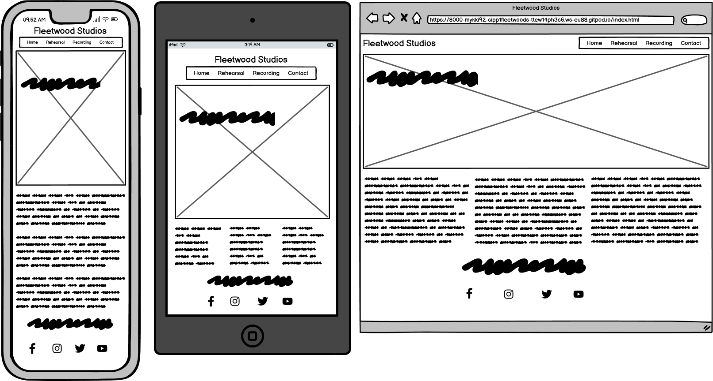

Rehearsal

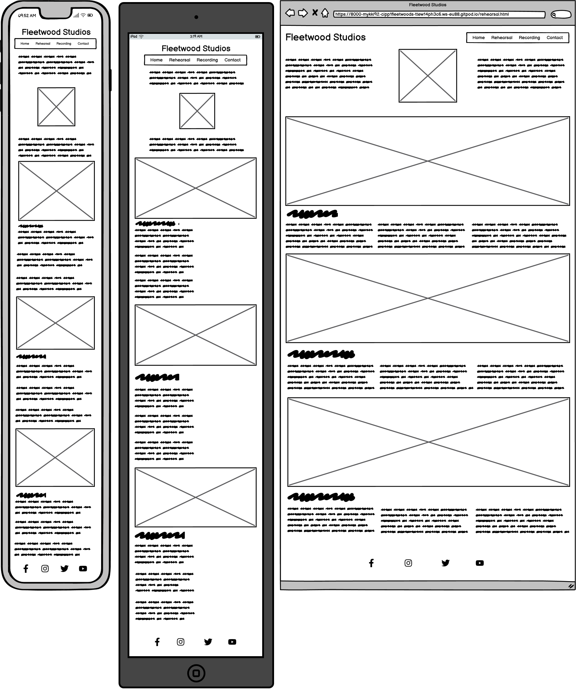

Recording

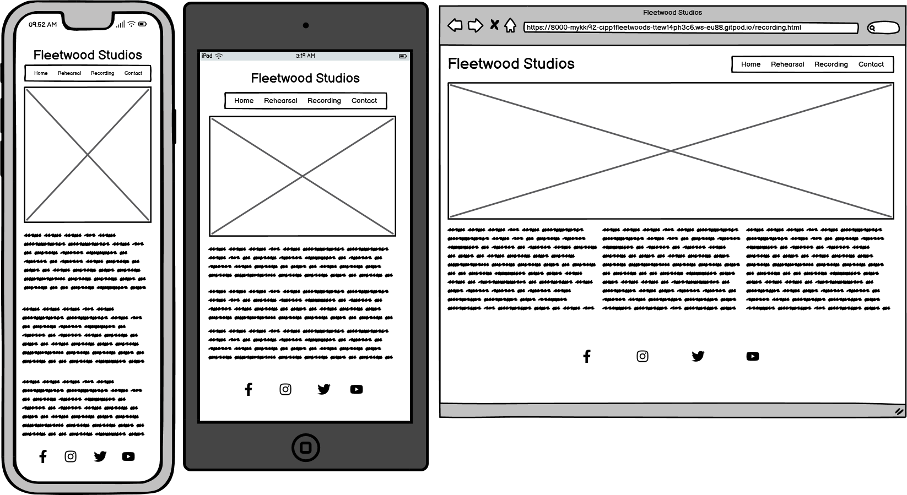

Contact

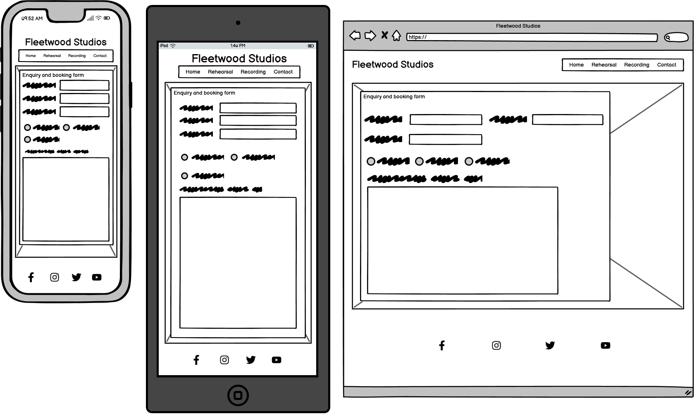

## Technologies Used

### Languages
- HTML
- CSS

### Frameworks & Tools
- Git
- GitHub
- Gitpod
- Tinypng
- Balsamiq
- Google Fonts
- Font Awsome
- Favicon

## Features

### Logo and Navigation Bar

### Footer

### Contact Form

### Map

## Validation

### HTML Validation
The W3C Markup Validation Service was used to validate the HTML of the website. All pages pass with no errors no warnings to show.

Home

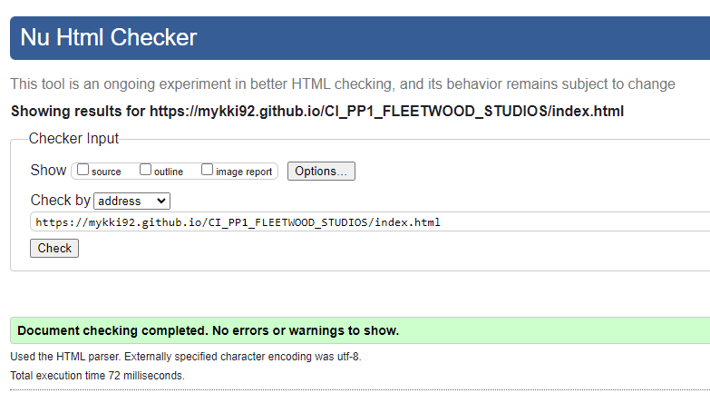

Rehearsal

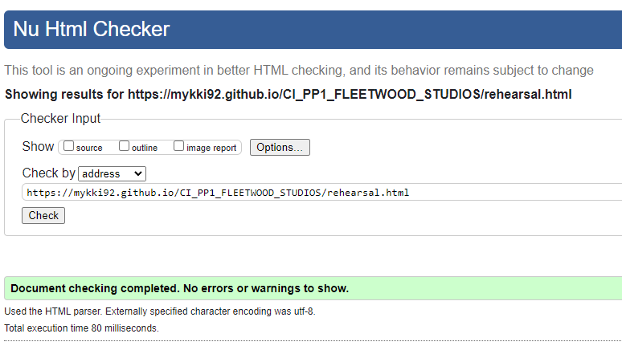

Recording

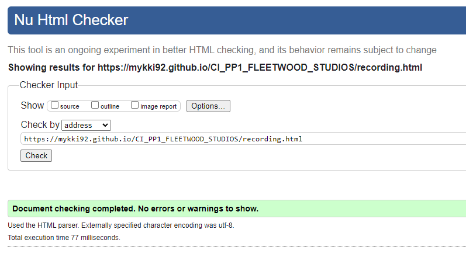

Contact

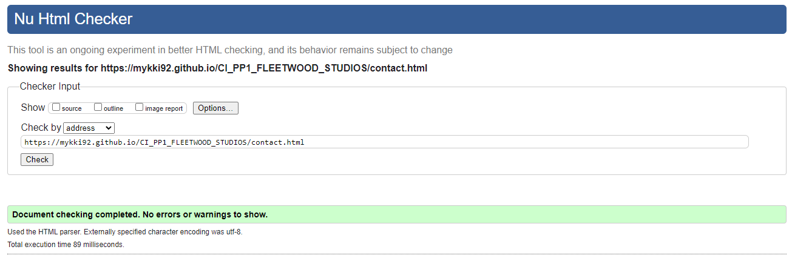

### CSS Validation
The W3C Jigsaw CSS Validation Service was used to validate the CSS of the website. All CSS passed with no errors or warnings to show.

whole page

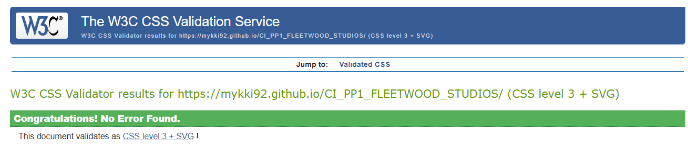

style.css

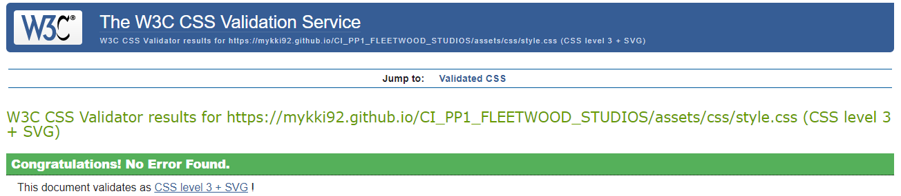

### Accessibility
The WAVE WebAIM web accessibility evaluation tool was used to ensure the website met high accessibility standards. All pages pass with 0 errors.

Home

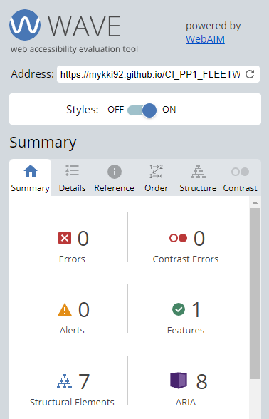

Rehearsal

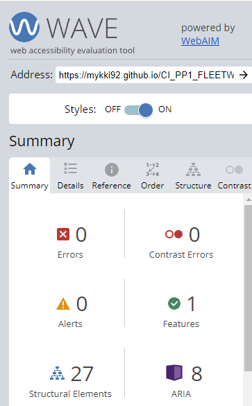

Recording

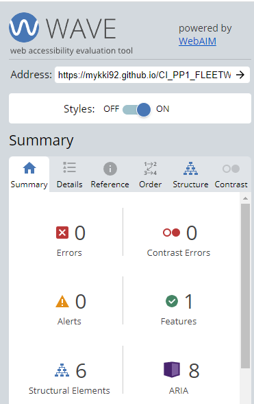

Contact

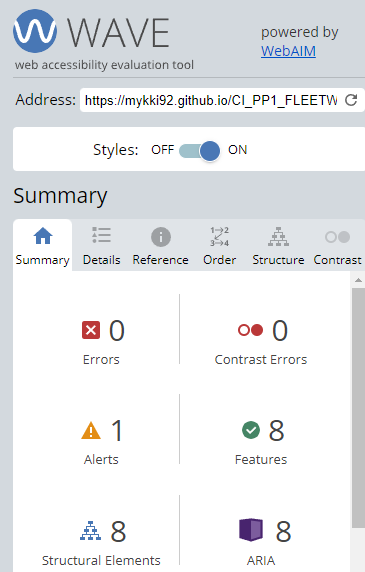

### Performance 
Google Lighthouse in Google Chrome Developer Tools was used to test the performance of the website. 

Home

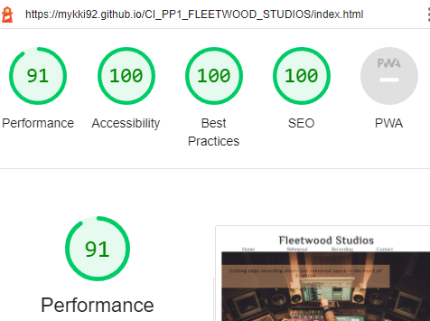

Rehearsal

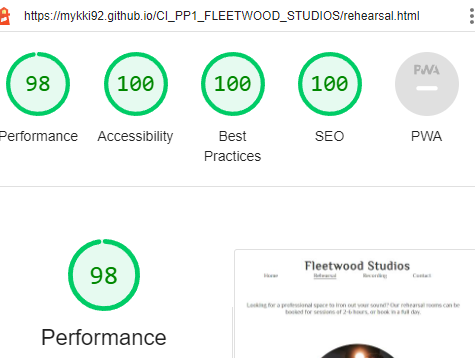

Recording

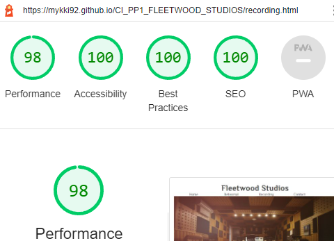

Contact

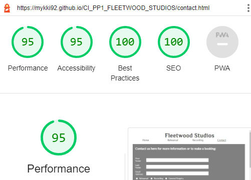

### Device testing 

### Browser compatability

### Testing user stories

## Bugs

## Deployment

## Credits

### Media

### Code

## Acknowledgements